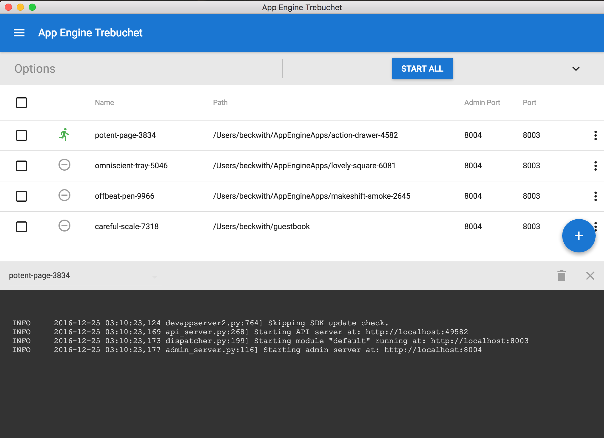
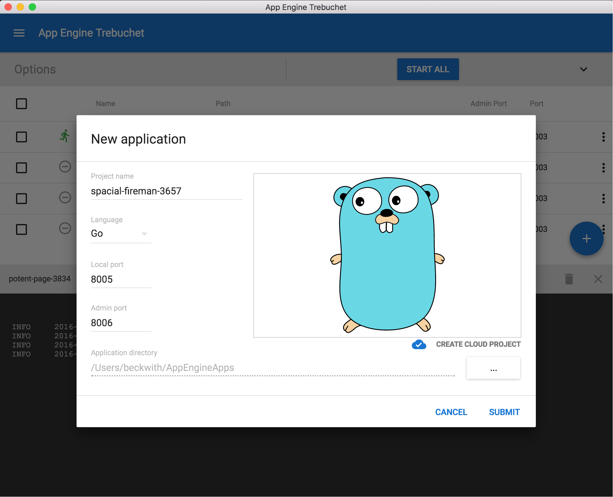

# App Engine Trebuchet
App Engine Trebuchet is a visual tool that makes it easier to create and deploy applications for App Engine.
It's meant to be a replacement for the App Engine Launcher.  

Trebuchet is super ultra expiremental, and under active development.  
**This is a not an official Google project.**

## Download
See [Releases](https://github.com/JustinBeckwith/trebuchet/releases).

## License
[Apache 2.0](LICENSE.md)

## Questions?
Feel free to submit an issue on the repository, or find me at [@JustinBeckwith](http://twitter.com/JustinBeckwith)
